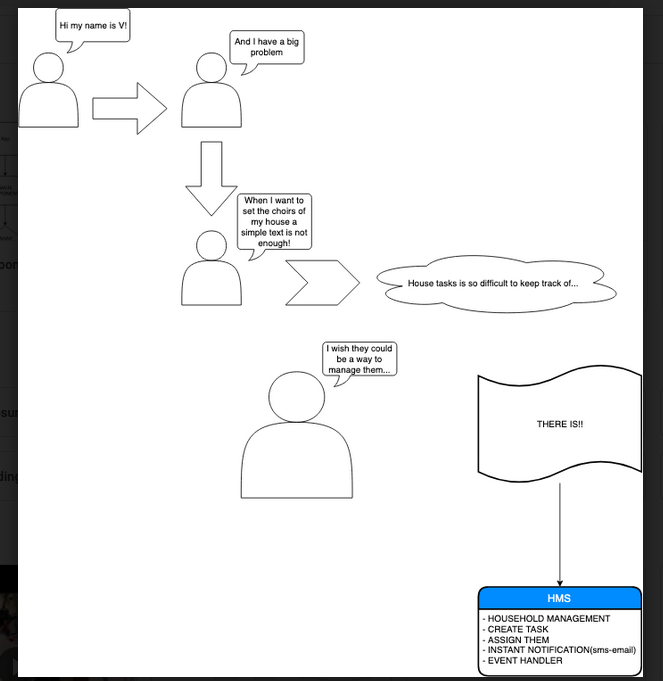
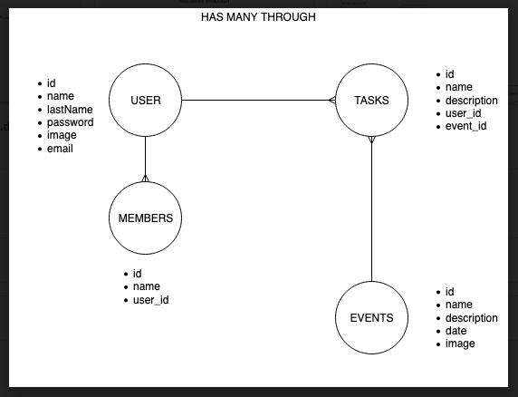
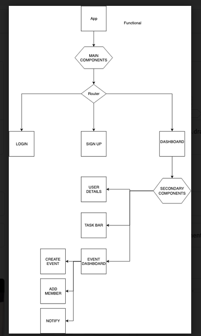
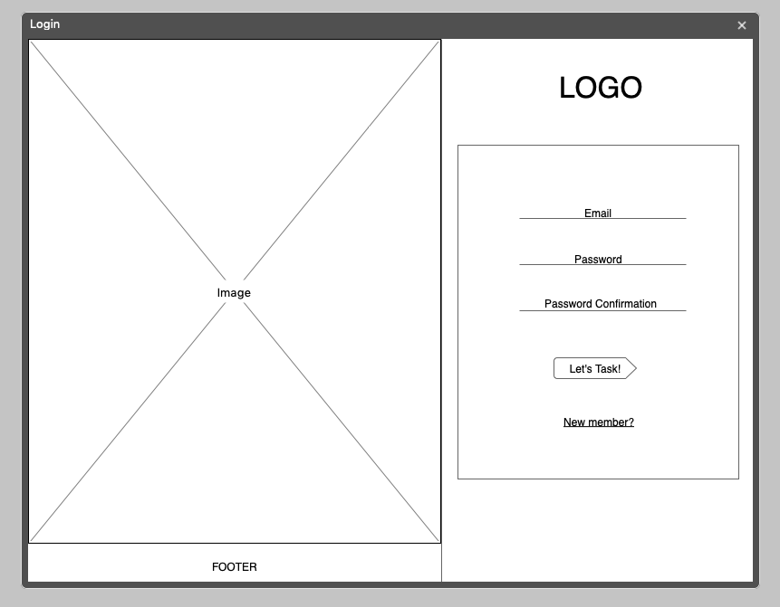
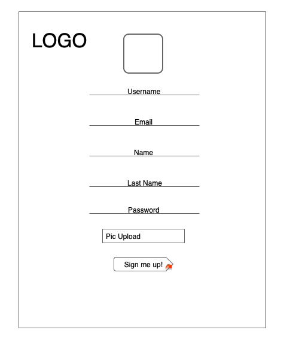
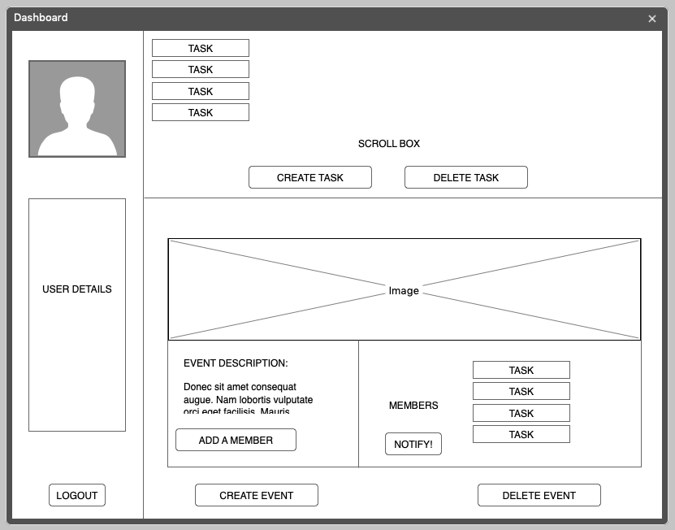
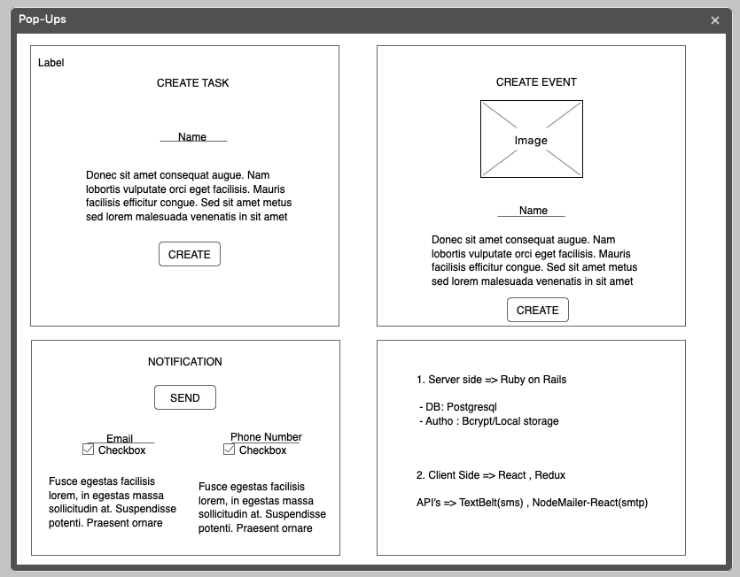

- House Management System

A prototype of management system that allows to manage a Household.(Assign tasks, create and events and send notifications via sms and smtp).

- User Stories:

- Server side models:

- Client side components:

- Wireframes:

 1. Login 
 

 2. Sign up
 

 3. Dashboard
 

 4. Pop ups
 

 ** Tools:

Server side: Ruby on rails 

   - DB: Postgresql
   - Autho: Bcrypt/Local storage

Client side:

   - React 
   - Redux
   - React-BootStrap
   - React-Routes

API's:

   - TextBelt(sms)
   - NodeMailer-React(smtp)

Copyright Vytautas Klimavicius 2019